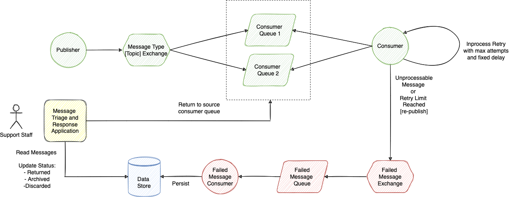
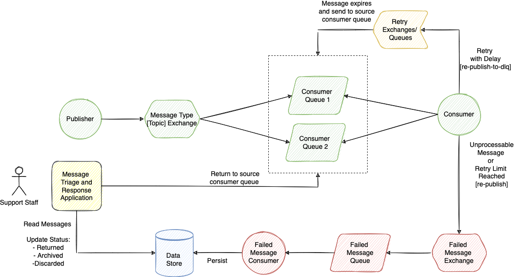
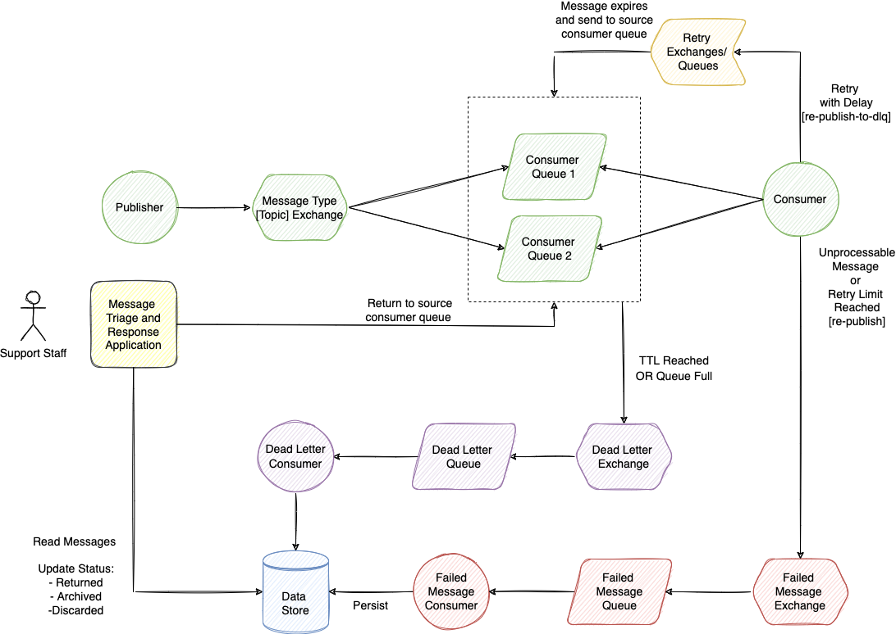
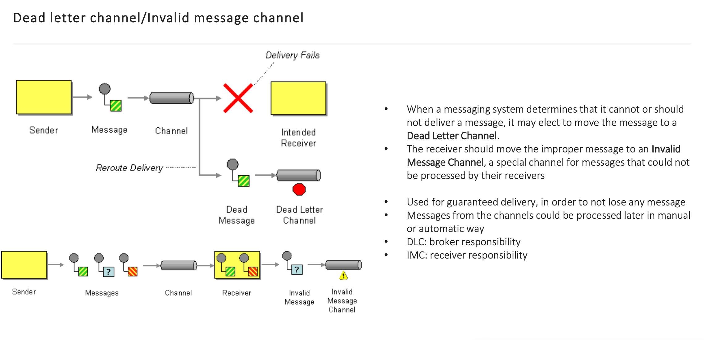

Practical Task:
I. Implement a Spring Boot application for sending notifications to customers
   about the receipt of goods based on the following architecture:

Notes:
1. Failed Message Exchange is not configured as DLX for the source queues.
   Consumer is responsible to re-publish failed messages.
2. Update previous implementation and change retry mechanism from inprocess
   to retry exchange/queue. Retry queue should have ttl, after message
   expires it should be routed to the source queue.

Notes:
1. Retry exchange is not configured as DLX for the source queues. Consumer
   is responsible to re-publish messages for retry. If retry limit reached
   message should be re-published to Failed Message Exchange instead.
2. Update previous implementation, configure message ttl, max size and dlx
   attributes on consumer queues. Expired messages or during queue overflow
   messages should be sent to DLQ by broker.

Notes:
1. Dead Letter exchange should be specified as DLX attribute on source
   queues in addition to message TTL and max length attributes.
